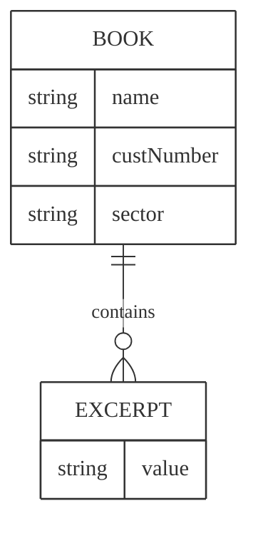

# Data model and features


## Data model
At this point the application has 4 tables already:
- A **_User** table 
- A **_Session** table 
- An **_Installation** table 
- A **CliNextApp** table that serves as a CliNext anchor towards which features that are geared towards the whole app will apply to

The _User, _Session and _Installation tables are automatically generated and handled by Parse Server. We will add fields to _User later.

We will need:
- A **Book** table to store the books users have read or want to read
- An **excerpt** table to store books excerpts
- A **Selection** table to store our editorial picks of the day 

The **Book** class will be central to our application as it will be
- bookmarkable
- followable
- commentable
- reactable (likes)
- sharable

The **Excerpt** class will also be central to our application as it allows a finer interaction between users, it will be:
- bookmarkable
- followable
- commentable
- reactable (likes)
- sharable

As we can see the **Book** and the **Excerpt** models share the same behaviour for basic social interactions. We will naturally extract these functionalities into **features** from the get-go.



## Applying features

We will need these fields in a Book:
- id
- name
- description
- genre
- author => Author
- ISBN
- excerpts => [Excerpt]

And for an excerpt:
- id
- name
- content
- book => Book

For an author:
- id
- name
- description
- books => [Book]

These fields are special to the Booklover application, we don't intend to move them onto a dedicated feature yet. They will sit within the app feature.

```mermaid
%%{
  init: {
    'theme': 'base',
    'themeVariables': {
      'primaryColor': '#fff',
      'primaryTextColor': '#323232',
      'primaryBorderColor': '#323232',
      'lineColor': '#323232',
      'fontFamily': 'Space Grotesk'
    }
  }
}%%
---
title: Book
---
classDiagram    
    Book <|-- Excerpt   
    Author <|-- Book
    class Book {
        +String id
        +String name
        +String description   
        +String genre
        +String authorName
    }
    class Excerpt {
        +String id
        +String name
        +String content
        +String bookId
    }   
    class Author {
        +String id
        +String name     
    }   
```

Let's see how applying features affects our models:

Book:
- id
- name
- description
- genre
- author => Author
- ISBN
- excerpts => [Excerpt]
- **followableEntries** 🆕
- **followableEntriesCount** 🆕

This feature also adds these functions:
- **followableFollow**
- **followableUnFollow**
