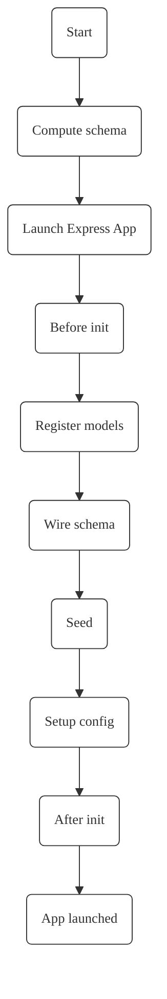

import SVGPlus from '@site/src/components/generic/svgplus'
import SVGComponent from '@site/src/components/generic/svg'

# Components

<SVGPlus name={'orchestration'} 
light={require('@site/static/diagrams/light/main.svg').default} 
dark={require('@site/static/diagrams/dark/main.svg').default} 
/>

### CliNext server
The CliNext server acts as a central orchestrator and mediator. It computes the target schema, calls for a database migration if needed, loads features, registers seeding, configuration, routes, jobs, etc.

### Features
CliNext streamlines the server development by separating every "groupable" logic to be a feature, so that it is organically extracted from the base code and possibly migrated into its own package. By doing so, CliNext enforces a clear separation of concerns pattern out of the box. 
[More](../features/feature.mdx)

Just like a docker image is made to be platform agnostic, a feature is designed to be as independent as possible from the current environment it's being used in. A feature might depend on other features, but it does not need to know which application it is used for, or call any of its API, unless they are registered as a [Service](../intercom.md)

### Framework engine
The framework engine is a bridge to a more traditional Node JS framework. It conforms to CliNext's [engine APIs](../engineapis.md). By separating the actual implementation from the high level object manipulation, the CliNext framework allows for a high reusability of your server and features code from the get-go.
[More](../engineapis.md)

## Model-feature relationship
<SVGPlus name={'orchestration'} 
light={require('@site/static/diagrams/light/architecure_features_models.svg').default} 
dark={require('@site/static/diagrams/dark/architecure_features_models.svg').default} 
/>

    <small><i>A view of a CliNext model-feature relationship tree</i></small>

## Lifecycle

When the server is launched, the clinext-engine performs the following tasks:

- Launches an Express app
- Computes the target database schema by aggregating the custom app tables and the features applied to those tables
- Checks if a schema migration is necessary. It migrates the schema or not accordingly
- Binds every feature to the events triggered by the tables that use them
- Exposes every feature custom function
- Registers jobs

<small>Ndoye Douts, Identité, 2022</small>