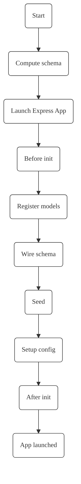

import SVGPlus from '@site/src/components/generic/svgplus'
import SVGComponent from '@site/src/components/generic/svg'

# Lifecycle

When the server is launched, the clinext-engine performs the following tasks:

- Launches an Express app
- Computes the target database schema by aggregating the custom app tables and the features applied to those tables
- Checks if a schema migration is necessary. It migrates the schema or not accordingly
- Binds every feature to the events triggered by the tables that use them
- Exposes every feature custom function
- Registers jobs

